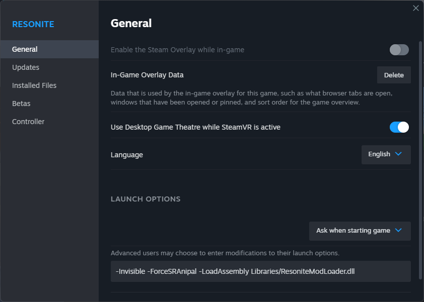

<!-- panels:start -->
<!-- div:title-panel -->
# Launch Arguments

<!-- div:left-panel -->
Resonite can be launched with a number of arguments.  
To use them, all you have to do is right click on Resonite on Steam, select "properties" and add your launch arguments to the text box.

## Most common

- `-Invisible` - Starts your game with the "invisible" status by default
- `-ForceSRAnipal` - Forces SRanipal to be launched (face tracking)
- `-LoadAssembly <path>` - Loads additional plug-ins
- `-ResetDash` - Resets your dashboard /!\ Will remove all your facets /!\
- `-SteamVR` - Launches the game with SteamVR
- `-RiftTouch` - Launches the game with Oculus rift + touch controllers
- `-Screen` - Launches the game in desktop mode
- `-SkipIntroTutorial` - Skips the tutorial on first uninitialized game launch
- `-DoNotAutoLoadHome` - Avoids loading your cloud home
- `-RepairDatabase` - Repairs the database
- `-forceNoVoice` - Disables voice
- `-data <path>` or `-dataPath <path>` - Sets the data storage path
- `-logs <path>` or `-logsPath <path>` - Sets the logs path
- `-cache <path>` or `-cachePath <path>` - Sets the cache path
- `-deleteUnsyncedCloudRecords` - Deletes records that couldn't be synced at the last closure /!\ Might lead to data loss /!\
- `-forceSyncConflictingCloudRecords` - Forces syncing of conflicting records /!\ Might lead to data loss /!\

## The rest

- `-Screen360` - Launches the game in desktop mode with 360 projection on
- `-ctaa` - Enables Cinematic Temporal Antialiasing, overrides the default FXAA
- `-ctaaTemporalEdgePower <num>` - Adjusts the Edge Power when using CTAA (values from 1.0 to 4.0; default is 4.0)
- `-ctaaSharpnessEnabbled <true/false>` - Adjusts or disables the CTAA sharpening (defaults to `false`)
- `-ctaaAdaptiveSharpness <num>` - Adjusts sharpness effect strength (values from 0.0 to 0.5; default is 0.2)
- `-enableOwO <IP>` - Sets the IP for the OwO haptics suit
- `-legacySteamVRInput` - Reverts inputs to the legacy SteamVR method
- `-etee` - Enables Etee controller support (??)
- `-device <Autodetect|Headless|Screen|Screen360|StaticCamera|StaticCamera360|SteamVR|WindowsMR|Oculus|OculusQuest>` - Sets the output device (defaults to `Autodetect`)
- `-forceRelay` - Force the use of the LNL relay
- `-forceSRanipal` - Force the use of SRanipal
- `-cameraBiggestGroup` - Adjusts the Biggest Group parameters when using `-device StaticCamera`
- `-cameraTimelapse` - ??
- `-cameraStayBehind` - Forces the camera to stay behind a user when using `-device StaticCamera`
- `-cameraStayInFront` - Forces the camera to stay in front of a user when using `-device StaticCamera`
- `-forceReticleAboveHorizon` - Forces the first person camera to aim above the horizon
- `-useAppCamera` - ??
- `-forceIntroTutorial` - Force start the tutorial on startup
- `-join <Auto | <Session>>` - Auto joins a session from URI
- `-OnlyHost <user>` - For use in conjunction with `-join`, only joins session if hosted by given user
- `-open <uri>` - Auto starts a world from URI (??)
- `-OpenUnsafe <uri>` Auto starts a world from URI in unsafe mode (??)
- `-noUI` - Disables UI display
- `-kiosk` - Starts the game in Kiosk mode
- `-bench <uri>` - Opens the world from the given URI, waits 30 seconds, records performance metrics, and quits the game (??)
- `-resetUserSpace` - Resets user space
- `-forceLANOnly` - Makes it so the game can only join LAN worlds
- `-watchdog` - If game freezes for over 10 seconds, dumps a bunch of debug info on next update tick (??)
- `-bootstrap <Assembly.dll>` - ??
- `-mixedReality` - ??
- `-directComposition` - ??
- `-externalComposition` - ??
- `-create_mrc_folder` - ??
- `-load-mrc-config` - ??
- `-exportDatabaseAll <path>` - Exports everything found in the database to the specified path
- `-exportDatabaseEngine <path>` - Exports records owned by local machine to the specified path
- `-disableNativeTextureUpload` - ??
- `-cubemapResolution <num>` - Sets the cubemap resolution
- `-screen` - Starts the game in desktop mode
- `-Verbose` - Enables verbose logging
- `-cloudProfile <Production|Staging|Local>` - Sets server (??)
- `-engineConfig <config.json>` or `-engineConfigFile <config.json>` - Sets the location of the configuration file
- `-GeneratePreCache` - ??
- `-priorityWorkers <num>` - Sets the number of priority workers
- `-BackgroundWorkers` - Sets the number of background workers

<!-- div:right-panel -->

<!-- panels:end -->

[Article by J4](../../_template/usageTerms/J4Credit.md ':include')
